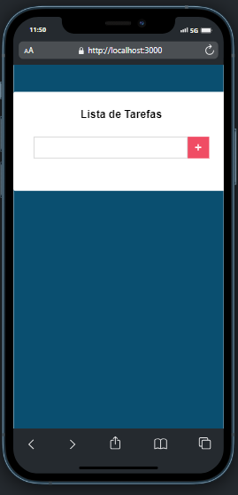
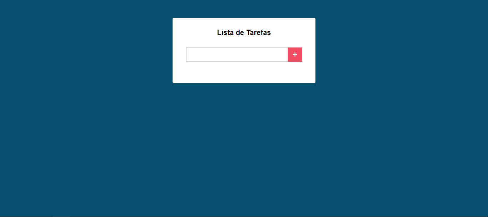

# Lista de tarefas 
[](https://github.com/GuilhermeHenrii/App-React-Lista-de-tarefas/blob/main/LICENSE) 

# Sobre o projeto

Uma pequena aplicação em React que tem como objetivo facilitar a sua vida por meio da criação de uma lista de tarefas, para melhor organizar seu dia a dia.

Nessa aplicação usei as Class Components, manipulei os estados direto em um componente Main, e separei os componentes de Formulário e Tarefas, para melhor entendimento do código.

Usei o localStorage para armazenar e persistir as tarefas.

## Layout mobile


## Layout web


# Tecnologias utilizadas
## Front end
- HTML / CSS / JS
- ReactJS
# Como executar o projeto
```bash
# clonar repositório
git clone https://github.com/GuilhermeHenrii/App-React-Lista-de-tarefas.git

# entrar na pasta do projeto
cd app-react

# baixar as dependências
npm install

# executar o projeto
npm run start
```

# Autor

Guilherme Henrique Da Silva Lopes

https://www.linkedin.com/in/guilherme-henrique-7aab6b229/